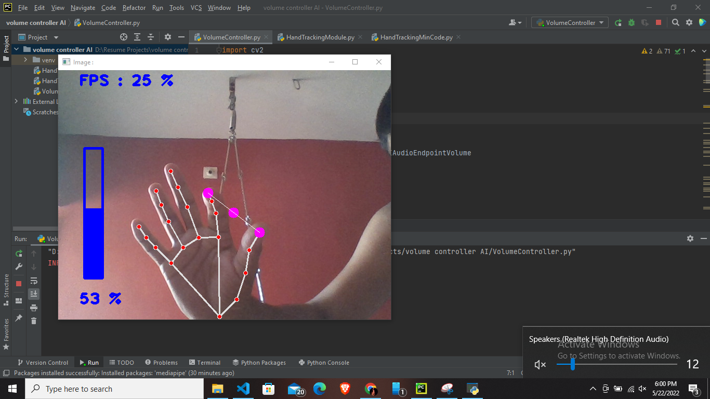
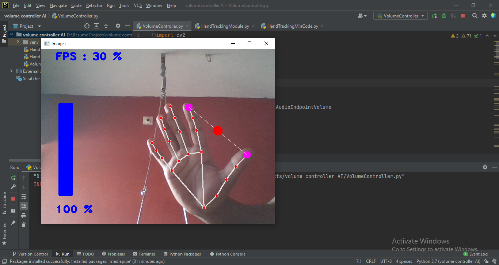

# Volume-Controller

# This is volume controller using thumb and index finger 
**Here I are calculating distance between thumb and index finger and from that calculated distance we are getting some percentage and through AudioUtilities we are assigning volume to system**
**I have set min distance for 0% volume and max distance for 100% volume**

# Images

**First Image**

**Second Image**

